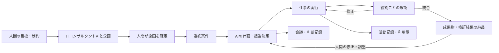

# Sikun Meeting 自律AI組織化の設計案

作業ID：20260924-autonomous-ai-organization

更新日：2026-09-24

状態：ITコンサルタントとの企画、自律実装、モデル方針、検証結果を反映した改訂版。

対象要件：R-01〜R-09、AC-01〜AC-07（`requirements.md`）

## 設計の前提

- **確定した要求**：既存の21ペルソナを維持し、ITコンサルタントAIを追加する。全員に同じPC操作能力を与える。人間とコンサルタントが企画を固めたら、AI組織が専門領域ごとに分担して実装・検証・納品する。人間の逐次承認は通常の進行条件にしない。
- **この設計で提案する初期範囲**：人間がITコンサルタントAIと目標・制約・完成像を相談し、企画を確定する。その後、AI組織が確認条件・作業計画・担当を定め、ソフトウェア・文書・調査などの成果物を作って検証し、まとめて納品する。人間は進行を観察し、修正・調整を返す。既存の21人全員を組織に残し、仕事に適した担当者を選ぶ。全員を毎回呼び出すことは要求と解釈しない。文化形成は後続の検討対象とする。
- **未決定の製品判断**：役割外操作を事後検知で扱うか事前遮断するか、人間に確認する例外の境界、PC操作に含める外部・不可逆操作、常時稼働の要否、最初の試験目標、利用枠と認証方式。以下は実装可能性を示す提案であり、合意済みの仕様ではない。

## 現在の実装から確認したこと

| 確認先 | 現状と設計への影響 |
|---|---|
| `src/core/types.ts`、`src/core/personas.ts` | `Project → Meeting → Message → Decision → ActionItem` と21ペルソナがある。仕事・実行・成果物・レビューの型はない。 |
| `src/core/services/decisionService.ts`、`projectService.ts` | 決定者は `chief` 固定。Action ItemはProjectへ転記されるが、会議内とProject内の完了状態は別に保持される。自動実行への接続はない。 |
| `src/core/agent/claudeAgent.ts`、`discussionService.ts` | 会議発言ごとにSDKを呼び、`Read/Grep/Glob`のみ許可。発言は逐次実行し、会議進行イベントだけをUIへ送る。 |
| `src/core/store/jsonStore.ts`、`repository.ts` | 会議とProjectを単一 `db.json` に保存する。新しい長時間実行のログまで同ファイルへ載せる構成にはしない。 |
| `src/main/ipc.ts`、`preload.ts`、`src/renderer/renderer.ts` | レンダラーはpreload経由でメインプロセスのサービスを呼ぶ。新しい画面もこの境界に従う。 |
| インストール済み `@anthropic-ai/claude-agent-sdk` の `sdk.d.ts` | モデル指定、`maxTurns`、`maxBudgetUsd`、中断、ツール使用前後のhook、結果の利用量情報を受け取る型がある。GUI操作の提供方法と配布版Electronでの動作は未検証。 |

`docs/product-requirements.md`、`docs/architecture.md`、`docs/decisions.md` は現時点で雛形のため、確定済み製品仕様の根拠として扱わない。

## 全体像

新しい `Commission`（委託案件）は人間の目標・制約・希望を起点とする。ITコンサルタントAIとの相談内容と企画版を保存し、人間が企画を確定した時点で自動実行を開始する。AIが不足情報を確認条件として整理し、仕事へ分解する。`WorkItem`（仕事）は実行管理の単位。既存の会議・Action Itemは案件内の相談や仕事の追加に利用できるが、開始の必須条件にはしない。仕事の完了、成果物の内部採用、案件全体の納品、人間からの修正依頼は別の状態として記録する。AIが出した判断を、既存の `Decision` に無条件で書き込まない。

| 記録 | 主な項目と役割 |
|---|---|
| `Commission` | `id`、`projectId`、人間が入力した目標・制約・希望、相談履歴、企画の版・確定日時、AIが整理した確認条件、進行状態、納品履歴、修正依頼。 |
| `WorkItem` | `id`、案件ID、任意の `meetingId/actionItemId`、親仕事、目的、成果物条件、担当、所管領域、確認者、依存先、状態、更新日時。 |
| `Run` | `id`、仕事ID、実行者、試行番号、要求モデル・観測モデル、開始・終了、停止理由、利用量、再開可否。実行のたびに新規作成する。 |
| `Artifact` | `id`、仕事・RunのID、保存先、差分またはハッシュ、提案・採用・差戻し状態、確認記録。 |
| `ActivityEvent` | `runId`、連番、日時、ツール・操作種別、対象の要約、結果、秘匿化した診断情報。 |
| `ReviewDecision` | 成果物ID、確認者、判断、理由、確認日時、参照した差分。採用後も履歴を残す。 |
| `WorkDecision` | 案件ID、決定者のペルソナ、対象領域、候補、判断理由、異論、確認者。AI組織の内部判断を既存の人間主導の `Decision` と区別する。 |
| `ProjectMemory` | プロジェクトの目標・決定・役割・成果物に関する要約、根拠の会議・仕事ID、有効状態、更新日時。 |

### 役割と判断の境界

各ペルソナには共通のツール能力を与える。一方、各仕事には `ownerPersonaId`（実行責任者）、`domain`（所管領域）、`reviewerPersonaId`（採用の確認者）、成果物、確認条件を記録する。専門領域の一覧は21人の既存ペルソナを基に設定データとして持ち、役職名をコード内の権限制御条件にしない。

ITコンサルタントは人間との企画相談の窓口となり、目的、完成像、制約、優先順位を整理して企画案を提示する。人間がその案を確定した後、Productが確認条件と仕事の候補を整理し、Architectが全体設計をまとめ、DesignerがUI方針、EngineerまたはBackendが実装、QAが品質、DevOpsが実行環境、Securityが情報保護を確認する。Researcher、Critic、Analystなど他のペルソナも案件の必要に応じて提案・調査・実行担当になれる。人間に個別割当を求めず、AIが担当と確認者を選ぶ。同一人物が自分の成果物を採用することは避け、所管が曖昧な仕事はProductと関連領域の担当が決める。

たとえばEngineerがDesigner所管のデザイン変更を思いついた場合、提案と作業ログは記録できるが、デザイン基準・成果物の状態はDesignerの確認が終わるまで `proposed` のままにする。**全員がPC全体を直接操作できる前提では、ファイル変更そのものをアプリの承認状態だけで事前に遮断できない。** 初期案では作業用Git worktreeまたは専用ディレクトリを通常の作業場所とし、差分・実行ログから逸脱を検知して採用を止める。worktreeは操作範囲を強制する隔離機構ではない。事前遮断が必要なら、全員フル権限の意味を再定義し、OS権限・実行隔離を要件段階から見直す。

AIは確定した企画の範囲で、確認条件、作業分解、担当、仕様、設計、実装方法を自ら決め、`WorkDecision` に根拠を残す。人間の逐次承認は求めず、所管するAI同士の内部レビューを通して先へ進む。既存の会議 `Decision` の `chief` 固定は過去の会議データとの互換性のため維持する。案件内で開いた会議のAI判断は別の `WorkDecision` に記録する。企画に含まれない目標変更や外部送信・公開・購入などは自動実行の対象を決める際に区別する。

### 仕事の状態と実行

`WorkItem` の状態は `queued → ready → running → review_pending → accepted` を基本とし、`blocked`、`paused`、`failed`、`cancelled`、`rejected` を別に持つ。状態遷移と実行開始をメインプロセスの `WorkCoordinator` に集約し、UIからの直接書換えを受け付けない。依存する仕事・決定が未完了なら `ready` にしない。

人間が目標を入力すると案件は `consulting` となり、ITコンサルタントAIとの複数ターンの相談を保存する。人間が企画案を確定すると `running` となり、AIが確認条件と計画を作り、担当・成果物条件を揃えた仕事から自動実行する。会議で生じたAction Itemも安定した `(meetingId, actionItemId)` で同じ案件へ取り込める。AIが仕事を分解して増やす場合は案件と親仕事を必須とし、連鎖数・同時実行数・利用枠で上限をかける。初期値は同時実行1件を提案する。アプリ起動中にキューを処理し、終了時は停止、次回起動時に状態を復元する。OSに常駐する形は別の判断とする。

案件内の各仕事は領域担当が確認する。必要な仕事が揃ったらAIが成果物を統合し、目標との対応、検証結果、未完了項目、作成ファイルを一つの納品画面にまとめる。AI内部の確認が終われば自動的に納品状態へ進み、人間の確認待ちで進行を止めない。人間が修正を入力すると既存案件の新しい改訂として記録し、関係する仕事だけ再開する。

実行前に `Run` を永続化し、開始時刻・担当・依頼モデル・入力の参照・試行回数を記録する。SDKの会議用呼び出しとは別の `WorkAgentRunner` を設け、ファイル編集・コマンド実行を使う。各ペルソナには同じツールセットを渡し、SDKの権限確認を省く設定を使う場合は、必要なオプションと配布版での挙動を確認する。GUI操作はSDK標準ツールで実現できると仮定せず、別の `ComputerAdapter` を接続し、実機・配布版で操作と記録を検証する。プロバイダを接続できない間はGUIを要する仕事を `blocked` と表示する。

実行中のSDKメッセージとツール使用前後のイベントを `ActivityEvent` に変換し、人間が「誰が、いつ、何をしたか」を時系列で見られるようにする。ファイル成果物は保存先、差分またはハッシュ、作成したRun、確認者、採用状態を記録する。ツールのログだけでは変更の完全な証明にならないので、採用時に作業ディレクトリの差分も照合する。秘密情報や認証値はログにそのまま保存しない。

一時停止・停止は新規のSDK呼び出しを止め、進行中の呼び出しには中断を通知する。停止時に外部操作が完了したか不明な場合は `interrupted` として残し、再起動後に副作用を確認するまで自動再試行しない。再開可能な仕事だけ、新しいRunとして再実行する。これにより同一仕事の無条件な二重実行を避ける。

### 記憶と次の会議への反映

長期記憶は、過去の全議事録を毎回渡す方法ではなく、根拠を持つ `ProjectMemory` と直近の案件・仕事・決定の要約で構成する。仕事の開始時には元の目標、関連する内部判断、役割、未解決の依存、過去の成果物を選んで渡す。採用済みの成果物や所管者の判断を記憶に反映し、次の仕事・会議の文脈とProject画面から参照できるようにする。要約の更新は元の案件・会議・Runを消さず、誤った要約を訂正できる履歴を残す。

役割の割当変更とレビューのやり取りは組織イベントとして保存する。コミュニティ・文化形成を主軸にする判断があれば、関係性や慣習についても「誰の提案か」「どの出来事を根拠とするか」「採用された設定か」を同じ仕組みで記録する。初期案では関係性の数値化や人格変化を実装済みの仕様として扱わない。

### モデルと利用枠

案件設定に相談・計画・実作業・内部確認、重要判断、代替のモデルとペルソナ別指定を持つ。ペルソナ指定があれば優先し、次に計画と重要仕事・所管判断、最後に通常フェーズの設定を使う。既定は通常 `claude-sonnet-5`、計画と重要判断 `claude-opus-5-5`、混雑・利用不可時のSDK代替 `claude-haiku-4-5-20251001`。Runには要求モデル、応答モデル、利用したモデル一覧を残す。代替はSDKの `fallbackModel` に委ね、上限到達や作業失敗には適用しない。

1 Runあたりの最大ターン数・時間と案件あたりの呼び出し回数を設定する。新しい呼び出しの直前に回数上限を確認し、超過時は失敗理由を表示する。SDKの推定料金は画面に出さず、金額上限や `maxBudgetUsd` も指定しない。SDKが返した推定値は診断用の内部記録としてのみ保持する。既存案件データに残る金額上限は読み取れても適用しない。

## 構成と変更箇所

| 変更箇所 | 変更内容 | 対応条件 |
|---|---|---|
| `src/core/personas.ts` | 既存21人を残し、AIのITコンサルタントを1人追加する。会議用の既定招集人数は変更しない。 | AC-01、08 |
| `src/core/types.ts` と新しい仕事用型 | `Commission`、相談履歴、`WorkItem`、`WorkDecision`、`Run`、`Artifact`、`ActivityEvent`、`ReviewDecision`、`ProjectMemory`、設定と状態遷移を定義する。既存のMeeting等の型を維持する。 | AC-01〜08 |
| `src/core/services/commissionService.ts`（新設） | 人間の目標入力、ITコンサルタントAIとの相談、企画確定、AIの計画、統合納品、修正依頼と改訂履歴を管理する。 | AC-02、07、08 |
| `src/core/services/decisionService.ts`、`projectService.ts` | 既存Action Itemを案件の仕事にも取り込めるようにする。既存の完了チェックと新しい仕事の状態が食い違う場合の同期規則を明示する。 | AC-01、02、04 |
| `src/core/services/workCoordinator.ts`（新設） | AIの担当決定・依存・レビュー・キュー・再開判定・上限を管理する。 | AC-02〜05、07 |
| `src/core/agent/workAgentRunner.ts`（新設） | 実作業用SDK呼び出し、モデル指定、中断、利用量・ツールイベントの収集を担う。会議発言用 `runAgentTurn` は残す。 | AC-01、02、05、06 |
| `src/core/store/workStore.ts`（新設） | 案件・仕事・Run・成果物・レビュー・ProjectMemoryの状態を `userData/data` の別ファイルで保存し、Runごとの活動記録を分離する。 | AC-01、02、04、07 |
| `src/main/ipc.ts`、`preload.ts` | 仕事一覧・詳細・操作・設定・進捗購読の限定したIPCを追加し、入力をメイン側で検証する。 | AC-02〜06 |
| `src/renderer` | 目標入力、ITコンサルタントAIとの相談、企画確定、AIの計画、既存21人とコンサルタントの一覧、実行中の仕事、納品物、修正入力、停止理由、モデルとターン数を表示する。SDK推定料金は表示しない。既存の円陣・Project画面から遷移できるようにする。 | AC-01〜09 |

## データと外部への影響

新しいデータは既存の `db.json` と分ける。`WorkStore` は同一プロセス内の更新を直列化し、状態ファイルを一時ファイルからアトミック置換する。活動記録はRun別の追記ファイルとし、起動時に末尾の不完全な記録を検出する。人間が入力した目標と修正内容は原文を保持し、AIが作った計画・確認条件と区別する。既存Action Itemからの取り込みは安定した複合キーで冪等に行い、片側だけの保存に終わっても再起動時に照合して補修する。既存 `db.json` の読み取りに失敗した場合に空データとして続ける現行動作は、移行時にデータ消失を隠しうるため、バックアップとエラー表示を追加する。ログの肥大化に対する保持・書き出し規則も実装時に定める。

レンダラーへはpreload経由の限定したIPCのみ追加する。ファイル操作・コマンド・GUI操作はメインプロセスの実行サービスから行い、成果物とログはアプリ内で表示する。GUI操作プロバイダと配布版でのSDK動作は実装前に検証する。外部への送信・公開・購入・削除・設定変更の扱いは未決定であり、初期の仕事として自動投入しない。ただしPC全体への権限を与えたAIがこれらを実行すること自体は、この仕事分類では技術的に遮断できない。

## 画面で人間が確認できること

- Project画面で目標を入力し、ITコンサルタントAIと相談して企画案を編集・確定できる。企画確定後はAIが立てた計画、担当、依存、実行・停止理由、使用モデルとターン数を開ける。
- 仕事の詳細で、実行の時系列、変更差分、成果物、確認者の判断を辿れる。案件の納品画面で完成物と検証結果をまとめて受け取り、修正・調整を返せる。
- 既存21人とITコンサルタントの一覧で役割、現在の担当、直近の活動を見られる。会議中の座席表示はそのまま使い、仕事の進捗イベントは別に購読する。
- 再起動後、未完了仕事と中断Runを確認して、安全なものだけ再開できる。

## 確認する範囲

| 条件 | 検証内容 |
|---|---|
| AC-01 | 既存データをバックアップして読み込み、21ペルソナ、議事録、決定、Action Itemの表示と操作を確認する。`npm run typecheck`、`npm run build` を実行する。 |
| AC-02 | 試験用Projectで目標を入力し、企画を確定した後、人間の個別割当なしにAIが計画・担当・実装を進める。Run・活動記録・実ファイル・UIのリンクを照合する。 |
| AC-03 | EngineerがDesigner所管の変更を提案するシナリオで、提案が採用前に区別され、確認履歴が残ることを確認する。フル権限下でファイル変更そのものは遮断できないことも明記する。 |
| AC-04 | SDK実行中に停止・再起動し、中断Runが重複して自動実行されず、確認後に新Runで再開できることを確認する。 |
| AC-05 | 模擬SDK失敗、タイムアウト、呼び出し回数上限で、次の呼び出しが止まり理由が表示されることを確認する。 |
| AC-06 | Sonnet/Haikuの割当を変えて試験実行し、要求モデルと実際のモデル、利用量の記録を確認する。具体的なモデルIDと認証は検証時の環境に合わせる。 |
| AC-07 | 納品物に人間が修正を入力し、AIが関連する仕事を再開して差分と再検証結果を納品することを確認する。 |
| AC-08 | ITコンサルタントAIとの相談を複数ターン行い、企画案を確定する。確定前には実作業が始まらず、確定後は人間の個別承認なしに納品まで進むことを確認する。 |
| AC-09 | 設定・実行履歴に推定料金が表示されず、模擬SDKの推定値が旧上限を超えても納品できることを確認する。呼び出し回数上限は別に確認する。 |

配布版でのSDK実行、GUI操作プロバイダ、Windows上のファイル差分取得は個別の実機検証が必要。実装タスクと検証コマンドは、設計レビュー後に `tasklist.md` へ落とし込む。

## 設計レビューで確認する未決定事項

| 論点 | この下書きの提案 | 判断が変わると影響する設計 |
|---|---|---|
| 役割外操作 | 全員フル権限を優先し、差分検知と採用保留で扱う。 | 事前遮断なら権限・隔離モデルを再設計。 |
| 人間への確認境界 | 人間はITコンサルタントAIと企画を確定する。以後はAIが仕様・設計・実装を決め、役割ごとの内部レビュー後に納品する。 | 企画の範囲外の新目標や不可逆な外部操作は、企画に明記された範囲との照合方法を追加。 |
| 外部・不可逆操作 | 範囲は未決定。初期成果物はローカルファイルを想定する。 | 送信・公開・購入等を含める場合は操作記録・再試行・確認過程を追加。 |
| 最初の試験目標 | 人間が一つの目標を提示し、AIが計画からファイル成果物の納品まで行う縦断例とする。 | 試験目標の種類に応じて成果物の確認方法を変える。 |
| 継続運転 | アプリ起動中の自動処理と次回起動時の復元を初期案とする。 | 常時稼働には常駐プロセス・OS起動・更新時停止の設計が必要。 |
| 利用枠・認証 | 推定料金は表示・停止条件に使わず、呼び出し回数とターン数・時間で制御する。 | 契約の扱いが変わった場合は別の明示的な設定として再設計する。 |

## 設計変更の記録

2026-09-24：ユーザーが「目標を提示したらAIたちができる限り実装し、成果物とする。人間は細かな修正・調整を担う。SIerへの委託に近い」と説明した。これに合わせ、入口を `chief` が確定するAction Itemから人間の `Commission` に変更し、AIによる計画・担当決定・実装・統合納品・修正の循環を追加した。既存Action Itemは互換性のある任意の入口として残す。

2026-09-24：ユーザーがSDKをサブスクリプション利用として扱い、推定料金の表示は不要と指定した。画面から金額と上限入力を外し、見えない金額による自動停止も撤廃する。SDK推定値は診断用記録に限定する。

2026-09-24：さらに、人間がAIのITコンサルタントと企画し、企画確定後はAI組織に実装を任せると明示した。ITコンサルタントを追加し、相談・企画確定を唯一の通常の事前確認段階とした。ユーザーは改訂した要件・設計・タスクの承認と実装を明示的に指示した。

2026-09-24：改訂要件・設計・タスクはユーザーの一括承認指示に基づいて順に承認を記録し、実装を開始した。その後、通常Sonnet・重要時Opus 5.5・代替Haikuという追加指示を受けた。SDK 0.3.258ではOpus 5.5が未対応だったため0.3.281へ更新した。最新版の文書を順に再提出する。

## 実装後に確認した構成と設計との差

- 初期版は `src/core/commission/service.ts` がCoordinatorと案件サービスを兼ね、`CommissionStore` が案件・仕事・Run・成果・判断・記憶を保存する。別名の `WorkCoordinator`、`WorkStore` は作っていない。
- Action ItemはProject画面のボタンから案件へ取り込み、元の `(meetingId, actionItemId)` で重複作成を防ぐ。既存Action Itemを無条件で自動実行・完了同期しない。
- `ProjectMemory` は内部採用済みの仕事の要約と成果ファイルを保存し、同じProjectの次の計画へ渡す。会議の議事録との自動統合や文化形成は含まない。
- ファイルの変更追跡は作業ディレクトリの実行前後のSHA-256比較で行う。ディレクトリ外、除外した依存・ビルドフォルダ、GUI上の非ファイル成果は自動追跡しない。全員共通の実作業SDKツールからOrca computer CLIを呼べるが、このWindowsプロバイダは`screenshots`権限を`unsupported`と返し画像取得も失敗したため、GUI操作の配布版検証は未完了。
- Windows配布版ではSDKのネイティブClaude実行ファイルを `resources/claude.exe` に配置する。初回のasar内配置では起動失敗したため方式を変更し、配布版からITコンサルタントAIの相談応答まで実機で確認した。
